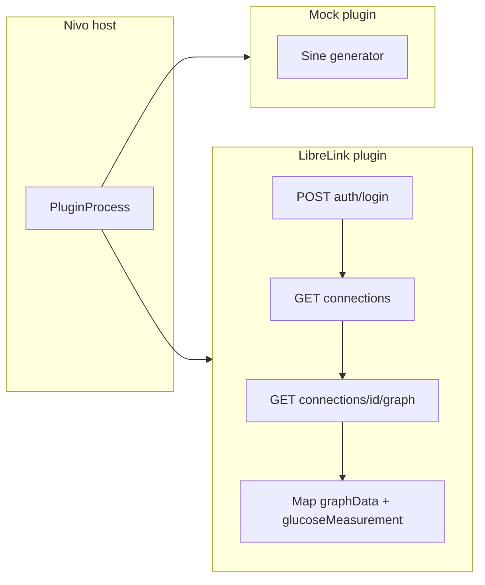

# Nivo plugin protocol v1

Canonical **stdin/stdout** contract for every CGM plugin (Mock, LibreLink, future vendors). One JSON object per line; one response line per command.

Host: Flutter desktop (`PluginProcess`). Plugin: any language with line-based JSON.

---

## Transport

| Rule | Detail |
|------|--------|
| Encoding | UTF-8 |
| Framing | One line per message, trailing `\n` |
| Request | `{ "command": "<name>", ... }` |
| Response | `{ "success": true, ... }` or `{ "success": false, "error": "..." }` |
| stderr | Log only; never parsed as protocol |

---

## Session fields (after `authenticate`)

Passed on `getDataSources`, `getCurrentReading`, `getHistory`:

| Field | Type | Required | Description |
|-------|------|----------|-------------|
| `authToken` | string | yes | Plugin-defined session token |
| `userId` | string | yes | Account or plugin user id |
| `dataSourceId` | string | no | Patient / connection id (LibreLink: `patientId`) |
| `options` | object | no | Plugin-specific (region, apiBaseUrl, clientVersion, …) |

---

## Commands

### `getPluginInfo`

**Request:** `{ "command": "getPluginInfo" }`

**Response (success):**

```json
{
  "success": true,
  "identifier": "mockcgm",
  "displayName": "Mock CGM",
  "version": "1.0.0",
  "author": "Nivo",
  "requiresLogin": true,
  "iconName": "mock",
  "capabilities": {
    "supportsMultipleDataSources": false,
    "supportsHistory": true,
    "maxHistoryHours": 24,
    "supportsSpecialValues": false,
    "requiresRegionSelection": false,
    "apiVersion": "1"
  }
}
```

| Capability | Type | Meaning |
|------------|------|---------|
| `supportsMultipleDataSources` | bool | Multiple `getDataSources` entries |
| `supportsHistory` | bool | `getHistory` implemented |
| `maxHistoryHours` | int | Max `hours` argument |
| `supportsSpecialValues` | bool | LO/HI in readings |
| `requiresRegionSelection` | bool | Legacy hint; prefer `signIn` with a `select` field |
| `apiVersion` | string | Must be `"1"` for host |
| `supportsCombinedFetch` | bool | Implements `fetchReadings` (see below) |
| `authKind` | string | Legacy fallback when `signIn` is omitted: `emailPassword` or `urlSecret` |

Optional **`signIn`** object — declarative sign-in form rendered by the host (no plugin-specific UI in Nivo):

```json
"signIn": {
  "hint": "Optional note shown above the form",
  "fields": [
    {
      "key": "region",
      "type": "select",
      "label": "Region",
      "options": [
        {"value": "us", "label": "United States"},
        {"value": "eu", "label": "Europe"}
      ]
    },
    {
      "key": "username",
      "type": "text",
      "label": "Email",
      "textInput": "email"
    },
    {
      "key": "password",
      "type": "secret",
      "label": "Password"
    }
  ]
}
```

| Field property | Type | Meaning |
|----------------|------|---------|
| `key` | string | Setting key. `username` and `password` map to `authenticate` credentials; other keys (e.g. `region`, `accessToken`) are stored in host `pluginSettings` and sent as `options`. |
| `type` | string | `text`, `secret`, or `select` |
| `label` | string | Field label (plugin-localized) |
| `textInput` | string | Optional keyboard hint: `email`, `url`, `number` |
| `options` | array | For `select`: `[{ "value", "label" }, …]` |

When `signIn` is present, the host renders it instead of inferring fields from `authKind`. Plugins should declare region pickers as a `select` field with key `region` rather than relying on `requiresRegionSelection` alone.

**LibreLink plugin example:** `identifier: "librelink"`, `requiresRegionSelection: true`, `supportsMultipleDataSources: true`, `maxHistoryHours: 24`, `supportsCombinedFetch: true`.

---

### `authenticate`

**Request:**

```json
{
  "command": "authenticate",
  "username": "email@example.com",
  "password": "secret",
  "options": {
    "region": "eu",
    "clientVersion": "4.16.0"
  }
}
```

**Response (success):**

```json
{
  "success": true,
  "authToken": "<opaque>",
  "userId": "<account-id>",
  "defaultDataSourceId": "<patientId-or-null>"
}
```

**Response (failure):**

```json
{
  "success": false,
  "error": "Invalid credentials"
}
```

| Field | Storage |
|-------|---------|
| `password` | Host memory only during sign-in; encrypted sidecar via SecureStorage |
| `authToken`, `userId` | SecureStorage + session |

---

### `getDataSources`

**Request:**

```json
{
  "command": "getDataSources",
  "authToken": "...",
  "userId": "...",
  "options": {}
}
```

**Response (success):**

```json
{
  "success": true,
  "dataSources": [
    { "id": "patient-uuid", "name": "Jane Doe" }
  ]
}
```

| Field | LibreLink source |
|-------|------------------|
| `id` | `connection.patientId` |
| `name` | `firstName` + `lastName` |

---

### `getCurrentReading`

**Request:**

```json
{
  "command": "getCurrentReading",
  "authToken": "...",
  "userId": "...",
  "dataSourceId": "patient-uuid",
  "options": {}
}
```

**Response (success):**

```json
{
  "success": true,
  "value": 112,
  "trend": "fortyFiveUp",
  "timestamp": "2026-05-30T14:05:00.000Z",
  "specialValue": null
}
```

| Field | Type | Notes |
|-------|------|--------|
| `value` | number | mg/dL integer (host converts mmol for display) |
| `trend` | string | See trend enum below |
| `timestamp` | string | ISO-8601 UTC |
| `specialValue` | string \| null | `"LO"`, `"HI"`, or null |

**Trend enum (all plugins):**

`notComputable`, `singleDown`, `fortyFiveDown`, `flat`, `fortyFiveUp`, `singleUp`, `doubleDown`, `doubleUp`

(Mock may use subset; LibreLink maps `TrendArrow` 0–5 to this set.)

---

### `getHistory`

**Request:**

```json
{
  "command": "getHistory",
  "authToken": "...",
  "userId": "...",
  "dataSourceId": "patient-uuid",
  "hours": 3,
  "options": {}
}
```

| Field | Constraint |
|-------|------------|
| `hours` | 1 … `maxHistoryHours` from capabilities |

**Response (success):**

```json
{
  "success": true,
  "readings": [
    {
      "value": 108,
      "trend": "flat",
      "timestamp": "2026-05-30T11:05:00.000Z",
      "specialValue": null
    }
  ]
}
```

| Rule | Detail |
|------|--------|
| Order | Ascending by `timestamp` |
| Density | Vendor-dependent (~5 min for LibreLink graph) |
| Filtering | Plugin filters to last `hours`; vendor may return fixed window |

---

### `fetchReadings` (recommended for polling)

**When:** Plugin sets `supportsCombinedFetch: true`. Host uses this for each connection poll instead of separate `getCurrentReading` + `getHistory`.

**Why:** Vendors such as LibreLink Up return current + series from **one** HTTP call (`GET …/graph`). Combined fetch = one subprocess message + one vendor request.

**Request:**

```json
{
  "command": "fetchReadings",
  "authToken": "...",
  "userId": "...",
  "dataSourceId": "patient-uuid",
  "hours": 3,
  "options": {}
}
```

**Response (success):**

```json
{
  "success": true,
  "current": {
    "value": 112,
    "trend": "flat",
    "timestamp": "2026-05-30T14:05:00.000Z",
    "specialValue": null
  },
  "history": [ { "value": 108, "trend": "flat", "timestamp": "...", "specialValue": null } ]
}
```

**Host fallback:** If `supportsCombinedFetch` is false, host calls `getCurrentReading` then `getHistory` in **one held subprocess** (still two commands, but one process lifetime).

`getCurrentReading` / `getHistory` remain required for compatibility and tooling.

---

## Plugin-internal connection points (LibreLink vs Mock)

Same **host commands**; different **internal** wiring:



| Host command | Mock internal | LibreLink internal |
|--------------|---------------|-------------------|
| `authenticate` | Return fake token | `POST /llu/auth/login` (+ region redirect) |
| `getDataSources` | One mock sensor | `GET /llu/connections` |
| `fetchReadings` | Single sine sample + series | **One** `GET …/graph` → map current + history |
| `getCurrentReading` | Sine at `now` | Graph → `glucoseMeasurement` (legacy / split) |
| `getHistory` | Sine samples 5 min | Graph → filter `graphData` (legacy / split) |

**LibreLink internal layout:** one HTTP endpoint class per Abbott path (`AuthLoginEndpoint`, `ConnectionsEndpoint`, `GraphEndpoint`, …); `GraphService` owns cache + mapping.

**Mock:** No HTTP; `getCurrentReading` and `getHistory` share the same generated series for consistency.

---

## Timeouts (host)

| Command | Seconds |
|---------|---------|
| `getPluginInfo` | 3 |
| `authenticate` | 30 |
| `getDataSources` | 30 |
| `getCurrentReading` | 10 |
| `getHistory` | 30 |
| `fetchReadings` | 30 |

---

## Error strings (conventional)

Plugins should use short English messages; host maps to `CgmError`:

| Message hint | `CgmError` |
|--------------|------------|
| `Invalid credentials` | `invalidCredentials` |
| `Not authenticated` | `notAuthenticated` |
| `No data` | `noData` |
| `Network` / `timeout` | `networkError` / `timeout` |
| Other | `pluginError` |

---

## Checklist: new plugin

- [ ] All five commands implemented
- [ ] Response JSON matches shapes above
- [ ] `apiVersion: "1"`
- [ ] `plugin.json` with entry executable path
- [ ] Document internal API mapping in `docs/plugins/<name>-plugin-considerations.md`
